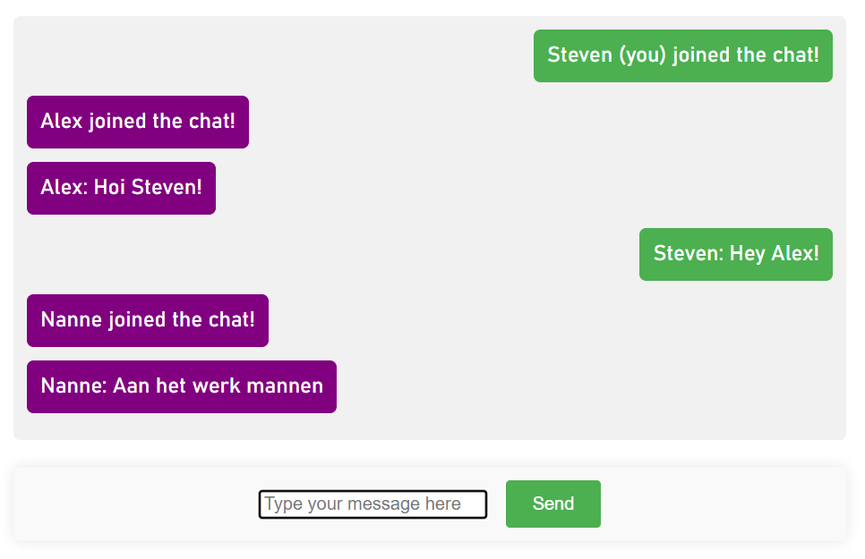

how to
installeer docker https://docs.docker.com/get-docker/
download en unzip
in terminal in folder
docker compose -f docker-compose.yaml up -d --build 
docker exec Mosquitto-TINNES-1 mosquitto_passwd -b /mosquitto/passwd/password_file Nanne Verheij
docker restart Mosquitto-TINNES-1
localhost in url balk

# TINNES-1 MQTT Chat App | Opdracht 1

<!--  -->


Opdracht 1 voor `Netwerken en Security vervolg` is een MQTT chat app maken. Deze app maakt gebruikt van een centrale  MQTT broker en een webserver voor de front-end, beide moeten draaien in een docker container.

Echter kwam ik erachter dat in de MQTT broker [`Mosquitto`](https://mosquitto.org/) een ingebouwde webserver zat. Mosquitto serveert op dezelfde WebSocket zowel de MQTT broker als de front-end webpagina.

Vanwege de vermindering in configuratie en installatie werk is dit voor deze simpele applicatie een voordeel. Voor groot schaliger gebruik van een MQTT broker (of een andere back-end) is het handiger om de webpagina apart te laten draaien van de MQTT broker.


## Installatie
De applicatie draait op [**`Docker`**](https://docs.docker.com/get-docker/).

```
```

### .NET5
We volgen de stappen uit de volgende link https://www.makeuseof.com/install-dotnet-5-ubuntu-linux/

#### Begin met het downloaden en toevoegen van de microsoft package.

```
wget https://packages.microsoft.com/config/ubuntu/20.04/packages-microsoft-prod.deb -O packages-microsoft-prod.deb
sudo dpkg -i packages-microsoft-prod.deb
```

#### .NET5 heeft een afhankelijkheid libssl1.1 die niet automatisch wordt geïnstalleerd dus die moeten we eerst toevoegen.

```
echo "deb http://security.ubuntu.com/ubuntu focal-security main" | sudo tee /etc/apt/sources.list.d/focal-security.list
sudo apt-get update
```

#### Nu kunnen we de afhankelijkheden en .NET5 installeren, de volgorde is hierin belangrijk.
```
sudo apt install apt-transport-https
sudo apt-get install libssl1.1
sudo apt-get install -y dotnet-sdk-5.0
sudo apt upgrade
```

### PostgreSQL 14
#### PostgreSQL versie 14 installeren.

```
sudo apt-get install postgresql-14
```

#### Nu moeten we de instelling van PostgreSQL veranderen voor onze benodigdheden.
```
sudo nano /etc/postgresql/14/main/pg_hba.conf
```

#### Ga naar de onderkant van het bestand en zorg dat alles overeenkomt met de volgende afbeelding.
Als de website wordt gedraaid op een WSL instantie van linux is er een kans dat de `0.0.0.0/0` moet worden leeggelaten om te werken.


#### Open het postgresql.conf bestand.
```
sudo nano /etc/postgresql/14/main/postgresql.conf
```

Zoek de regel met `listen_addresses =` op en comment deze uit (verwijder de #) en maak er `listen_addresses = '*'`  van
Zoek de regel met `port =` op en maak daar `port = 9005` van.
Zie onderstaande afbeelding.


#### Start de postgreSQL service opnieuw op.

```
sudo systemctl restart postgresql.service
```

### Nginx
#### Nginx installeren.

```
sudo apt install nginx
sudo service nginx start
```

#### Instellingen van Nginx aanpassen.

```
sudo nano /etc/nginx/sites-available/default
```

#### Plak hetvolgende in het bestand en zorg ervoor dat de rest van het bestand uitgecomment is (met een # ervoor).
Zie onderstaande afbeelding.

```
server{
  listen 80;
  server_name raast.hr.nl *.hr.nl;
  location /{
    proxy_pass http://127.0.0.1:5001;
    proxy_http_version 1.1;
    proxy_set_header Upgrade $http_upgrade;
    proxy_set_header Connection keep-alive;
    proxy_set_header Host $host;
    proxy_cache_bypass $http_upgrade;
    proxy_set_header X-Forwarded-For $proxy_add_x_forwarded_for;
    proxy_set_header X-Forwarded-Proto $scheme;
  }
}
```


#### Controleer of het configuratie bestand correct is opgesteld en herstart Nginx.

```
sudo nginx -t
sudo nginx -s reload
```

### Remote control website
#### Download de laatse versie van de code uit deze branch en zet deze in een folder genaamd `remoteControl` in je home directory.

De folder staat dus op de volgende plek `~/remoteControl` en in die folder zit de code. Dus bv. `~/remoteControl/Controllers`.

#### Navigeer naar deze folder en installeer de .NET `ef` tool.

```
cd ~/remoteControl
dotnet tool install --global dotnet-ef --version 5.*
```

#### Installeer het .NET programma als service. Doormiddel van het aanmaken van een service bestand, deze in te vullen met de code uit de tweede code snippet en aan te zetten met het laatste commando.

```
sudo nano /etc/systemd/system/remoteControl.service
```
```
[Unit]
Description=remoteControle .NET Web App running on Ubuntu
[Service]
WorkingDirectory=/var/www/build
ExecStart=/usr/bin/dotnet /var/www/build/'Remote Control.dll'
Restart=always
# Restart service after 10 seconds if the dotnet service crashes:
RestartSec=10
KillSignal=SIGINT
User=root
SyslogIdentifier=dotnet-example
Environment=ASPNETCORE_ENVIRONMENT=Production
Environment=DOTNET_PRINT_TELEMETRY_MESSAGE=false
[Install]
WantedBy=multi-user.target
```
```
sudo systemctl enable remoteControl.service
```

#### Maak een database aan voor de website.

Log in op het linux postgres account en maak een database genaamd `database` aan.
Als de database al bestaat is dat geen probleem


```
sudo su postgres
createdb database
```

#### Maak een gebruiker PostgreSQL gebruiker aan genaamd `raast` met wachtwoord `password` (hiervoor moet je op het postgres linux account zitten).
Deze gebruikt het .NET programma om in te loggen op de database.
Wil je de gebruikersnaam en wachtwoord wijzigen kan dit in het bestand `remoteControl/Models/Database.cs`

```
psql
postgres=# create user raast with encrypted password 'password';
postgres=# grant all privileges on database database to raast;
postgres=# ALTER DATABASE database OWNER TO raast;
```
#### Gebruik `\l` in de `psql` omgeving om te controleren of je database is aangemaakt en gebruiker `raast` als eigenaar heeft.
Zie onderstaande afbeelding.
Als dit correct is gebruik dan `\q` om de `psql` omgeving af te sluiten en gebruik `su “je linux username”` om terug te gaan naar je eigen linux account (je kunt ook je terminal opnieuw openen).


#### Navigeer naar de `remoteControl` folder en gebruik het .NET `ef` commando.
Werkt het commando niet helpt de terminal opnieuw openen soms.

```
cd ~/remoteControl
dotnet ef database update
```

#### Controleer of er nu tabellen in je database staan. Zie onderstaande afbeelding.

```
sudo su postgres
psql
postgres=# \c database
postgres=# \dt
```


#### Met deze stap kun je inloggegevens voor de remote control website invoeren. Pas de `VALUES` aan om nieuwe of andere inloggevens aan te maken.
Deze commando's worden uitgevoerd als linux gebruiker `postgres` in de `psql` omgeving.

```
postgres=# INSERT INTO "Users"("username", "password", "isAdmin") VALUES('raast','password',true);
```

#### Navigeer terug naar je eigen linux account en de `~/remoteControl` folder. Build, publish en start het .NET programma.
Tijdens het builden en publishen wordt er een icoon van een zeilboot niet mee gekopieerd, dit doen we ook even handmatig. 

```
dotnet build
sudo dotnet publish -c Release -o /var/www/build
sudo cp ~/remoteControl/wwwroot/assets/sailboat.png /var/www/build/wwwroot/assets/
sudo systemctl restart remoteControl.service
```

De installatie in nu voltooid gebruik `sudo systemctl status remoteControl.service` om de status van de service te bekijken.

## Route inschieten
Gebruik voor het inschieten van een route bij type 4 een JSON string met de volgende opbouw.

De namen `waypoints` en `finish` zijn van groot belang en dienen op deze manier geschreven te worden zonder hoofdletters.

Als het `Recalibrate` vakje is aangevinkt wordt de huidige route gewist en deze ingeschoten. Als het vakje niet in aagevinkt wordt de route aan de bestaande route geplakt, de ingeschoten route zal dus na de bestaande route gevaren worden.

```json
{
  "waypoints": [
    {
      "lat": 51.89760416341354,
      "lon": 4.418206354725494
    },
    {
      "lat": 51.89760416341354,
      "lon": 4.418206354725494
    },
    {
      "lat": 51.89760416341354,
      "lon": 4.418206354725494
    }
  ],
  "finish":{
      "lat": 51.89760416341354,
      "lon": 4.418206354725494
    }
}
```

Changelog:

6 - 12 - 2023 [Eerste versie handleiding opgezet]

6 - 12 - 2023 [Spellingsfout verbeterd en voorbeeld afbeelding toegevoegd]

7 - 12 - 2023 [Spellingsfout verbeterd]

23 - 1 -2024 [Uitleg voor route inschieten toegevoegd]
